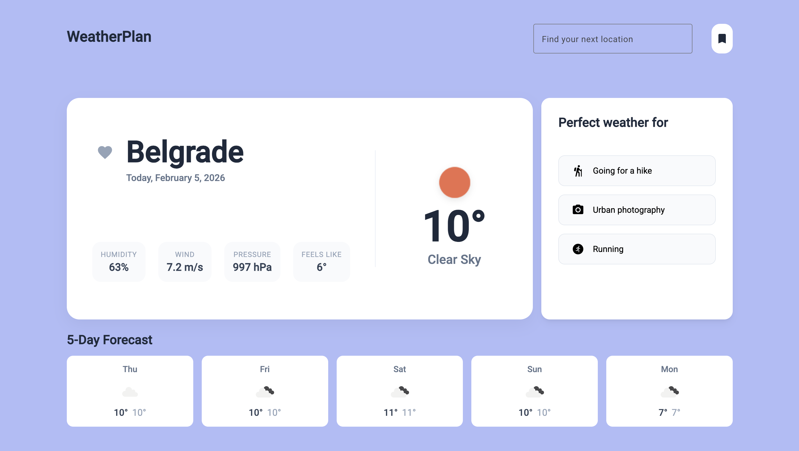

# WeatherPlan 🌦️


### [🚀 Click to View Live Demo](https://lenapuletic.github.io/weather-plan/)

A reactive weather dashboard built with **Angular 19**, designed to demonstrate modern state management patterns using a hybrid of **Signals** and **RxJS**.

The application goes beyond basic API calls by implementing robust error handling, local state persistence, and intelligent data transformation to provide activity suggestions based on real-time weather conditions.


## 🚀 Key Features

* **Smart Search:** Real-time city search with debouncing and autocomplete.
* **Reactive Dashboard:** Displays current weather, 5-day forecast, and environmental details (humidity, pressure, wind).
* **Activity Engine:** Suggests real-world activities (e.g., "Perfect for visiting a museum") based on temperature and weather codes.
* **Local Persistence:** Users can "bookmark" locations, which are saved to LocalStorage and persist between sessions.
* **Desktop-First UI:** A spacious interface optimized for desktop workflows.

## 🛠️ Technical Highlights

This project focuses on architectural best practices for modern Angular applications:

* **SignalStore Architecture:** leveraged `signalStore` with custom features (`withMethods`, `withHooks`) to manage global state (loading, error, data) in a clean, reactive way without the boilerplate of Redux.
* **Signals & RxJS Interop:** Uses **Signals** for synchronous UI rendering while leveraging **RxJS** for complex asynchronous event streams (search input handling).
* **Stream Safety:** Implements the `catchError` operator inside `switchMap` to prevent "Stream Death," ensuring the search observable stays alive even after API failures (404s).
* **Performance:**
    * **Debouncing:** Rate-limits API requests to prevent flooding the server.
    * **OnPush Strategy:** Optimized change detection cycles.
    * **TrackBy Optimization:** Uses unique keys (`$index` and `date` strings) in `@for` loops to minimize DOM re-rendering.
* **Error Handling:** Graceful UI recovery for network errors or invalid cities, preventing the application from crashing.
## 📱 Mobile Support Note

This application follows a **Desktop-First** design strategy.
To ensure quality, a responsive overlay has been implemented for screens smaller than 900px, politely directing users to a desktop device for the optimal experience.

## 🏃‍♂️ Getting Started

1.  **Clone the repository**
    ```bash
    git clone [https://github.com/YOUR_USERNAME/weather-plan.git](https://github.com/YOUR_USERNAME/weather-plan.git)
    cd weather-plan
    ```

2.  **Install dependencies**
    ```bash
    npm install
    ```

3.  **Run the application**
    ```bash
    ng serve
    ```
    Navigate to `http://localhost:4200/`.

## 🔮 Future Improvements

* Full mobile responsiveness adaptation.
* Unit testing with Jest.

---

_Built with ❤️ by Lena Puletic
