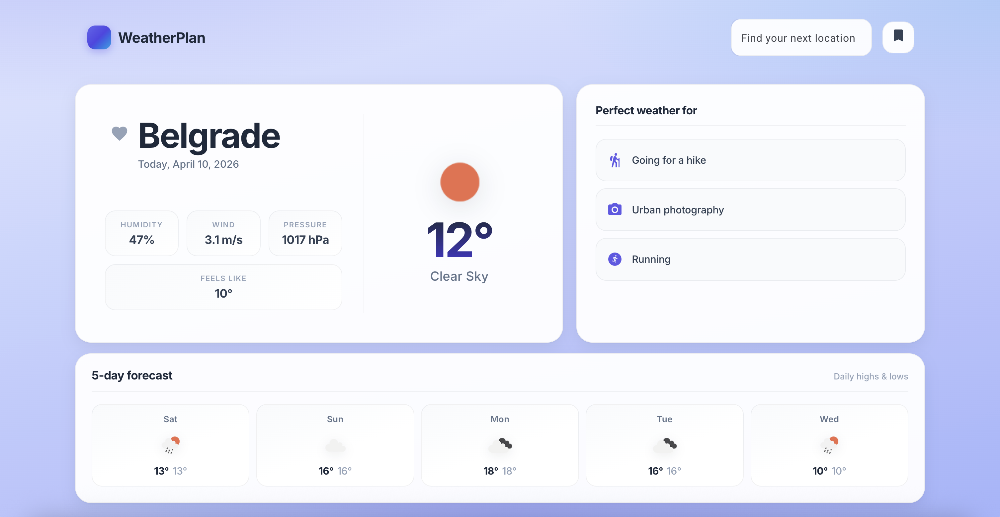

# WeatherPlan 🌦️


### [🚀 Click to View Live Demo](https://lenapuletic.github.io/weather-plan/)

A reactive weather dashboard built with **Angular 19**, designed to demonstrate modern state management patterns using a hybrid of **Signals** and **RxJS**.

The application goes beyond basic API calls by implementing robust error handling, local state persistence, and intelligent data transformation to provide activity suggestions based on real-time weather conditions. **Activity insight dialogs** use the **Google Gemini API** to generate short local tips when you tap a suggestion, with a Google Search fallback.



## 🚀 Key Features

- **Smart Search:** Real-time city search with autocomplete powered by the OpenWeather geocoding API.
- **Reactive Dashboard:** Displays current weather, 5-day forecast, and environmental details (humidity, pressure, wind).
- **Activity suggestions:** Six curated activities per weather profile; the UI shows **four at a time**, chosen at random whenever the current weather updates so the list feels fresh.
- **AI-generated activity insights (optional):** Select an activity to open a dialog with **Gemini**-generated tips for that city and activity (plus weather context). If no API key is configured or the model is rate-limited, the dialog still offers **Search on Google** and a clear message.
- **Local Persistence:** Users can "bookmark" locations, which are saved to LocalStorage and persist between sessions.
- **Responsive layout:** The UI adapts from large desktops down to narrow phones (flexible header, stacked dashboard and forecast, tuned spacing and typography).

## 🛠️ Technical Highlights

This project focuses on architectural best practices for modern Angular applications:

- **SignalStore Architecture:** leveraged `signalStore` with custom features (`withMethods`, `withHooks`) to manage global state (loading, error, data) in a clean, reactive way without the boilerplate of Redux.
- **Signals & RxJS Interop:** Uses **Signals** for synchronous UI rendering while leveraging **RxJS** for asynchronous streams (for example city search with `distinctUntilChanged` and `switchMap`).
- **Stream Safety:** Implements the `catchError` operator inside `switchMap` to prevent "Stream Death," ensuring the search observable stays alive even after API failures (404s).
- **Performance & UX:**
  - **Autocomplete pipeline:** Ignores duplicate consecutive queries and cancels in-flight geocoding requests when the user types again (`switchMap`).
  - **TrackBy Optimization:** Uses stable keys (`activity.title`, forecast date strings) in `@for` loops to minimize DOM re-rendering.
- **Error Handling:** Graceful UI recovery for network errors or invalid cities, preventing the application from crashing.

## 📱 Responsive design

The layout is built with **CSS breakpoints** so the same app works on wide monitors and small touch screens. On smaller viewports the header compacts (title, search, and saved locations stay usable), the weather dashboard and activity suggestions **stack vertically**, and the forecast section reflows instead of forcing horizontal scrolling. Breakpoints are tuned around **~600–900px** so tablets and phones get a readable, single-column flow without a separate mobile-only build.

## 🏃‍♂️ Getting Started

1. **Clone the repository**

   ```bash
   git clone https://github.com/YOUR_USERNAME/weather-plan.git
   cd weather-plan
   ```

2. **Install dependencies**

   ```bash
   npm install
   ```

3. **Environment files (local development)**

   The app reads API keys from [`src/environments/environment.secrets.ts`](src/environments/environment.secrets.ts) (committed **stub** in the repo; replace locally, never commit real keys). [`src/environments/environment.ts`](src/environments/environment.ts) is **gitignored** and imports that secrets module.
   - Copy the example app environment (only needed the first time):

     ```bash
     cp src/environments/environment.example.ts src/environments/environment.ts
     ```

   - Put your keys into `environment.secrets.ts` in either of these ways:
     - **Recommended (matches CI):** run the generator from the project root (requires `OPENWEATHER_API_KEY`; `GEMINI_API_KEY` is optional for AI tips):

       ```bash
       OPENWEATHER_API_KEY=your_key GEMINI_API_KEY=optional_gemini_key node scripts/generate-secrets.mjs
       ```

     - **Or** edit `src/environments/environment.secrets.ts` by hand (see [`environment.secrets.example.ts`](src/environments/environment.secrets.example.ts) for the shape).

   - Get an OpenWeather key at [OpenWeather](https://openweathermap.org/api).
   - **Optional — AI activity tips:** create a Gemini key in [Google AI Studio](https://aistudio.google.com/apikey). Under **Application restrictions**, use **HTTP referrers** and add your origins (for example `http://localhost:4200/*` for local dev and `https://YOUR_USERNAME.github.io/*` for GitHub Pages). The client calls Gemini with a **fallback chain** of Flash models when one returns 429 or quota errors; you can pin a model with `gemini.model` in [`environment.example.ts`](src/environments/environment.example.ts) / [`environment.prod.ts`](src/environments/environment.prod.ts).

   **`npm start`** runs `node scripts/generate-secrets.mjs --allow-missing` first: if `OPENWEATHER_API_KEY` is set in your shell, `environment.secrets.ts` is refreshed; if not, your existing `environment.secrets.ts` is left unchanged so local keys are not wiped.

   **If an API key was ever committed to this repository**, rotate it in the provider dashboard and use the new key only in `environment.secrets.ts` (local) or in CI secrets.

4. **Run the application**

   ```bash
   npm start
   ```

   Then open `http://localhost:4200/`.

### Production build and deploy

`npm run build` and `npm run deploy` require **`OPENWEATHER_API_KEY`** in the environment when `scripts/generate-secrets.mjs` runs (without `--allow-missing`), because the script overwrites `src/environments/environment.secrets.ts` before `ng build`. After a local production build, discard or revert changes to that file if it now contains real keys (do not commit them).

You can also set **`GEMINI_API_KEY`** so production bundles include the Gemini key. If it is omitted, the script writes an empty Gemini key and the app still runs; only the AI insight dialog shows the “not configured” path until you add a key.

```bash
OPENWEATHER_API_KEY=your_key npm run build
OPENWEATHER_API_KEY=your_key GEMINI_API_KEY=your_gemini_key npm run build
```

In GitHub Actions (or any CI), add `OPENWEATHER_API_KEY` as a secret and run `npm run build` or `npm run deploy`. Add `GEMINI_API_KEY` optionally if you want AI tips in deployed builds.

If you run `ng build` or `ng deploy` directly without the `npm run` scripts, run `node scripts/generate-secrets.mjs` first with `OPENWEATHER_API_KEY` set, or temporarily edit `environment.secrets.ts` locally (do not commit real keys).
